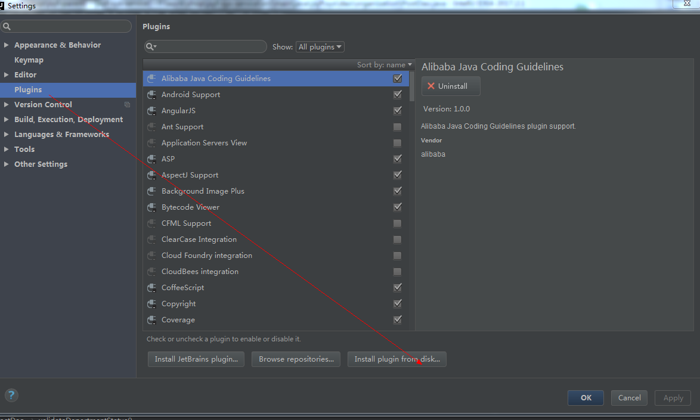
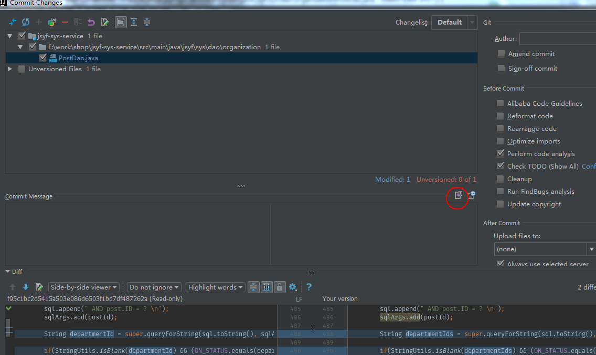
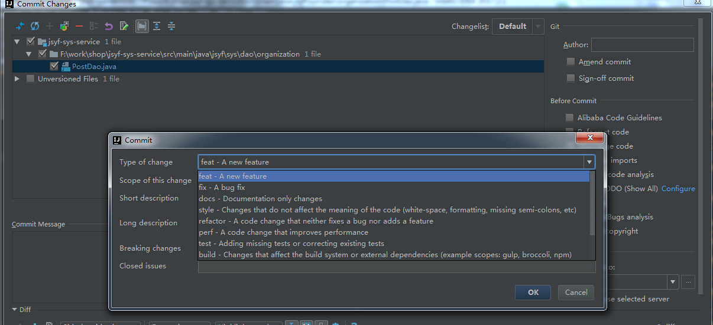
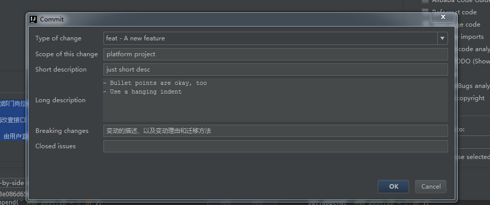
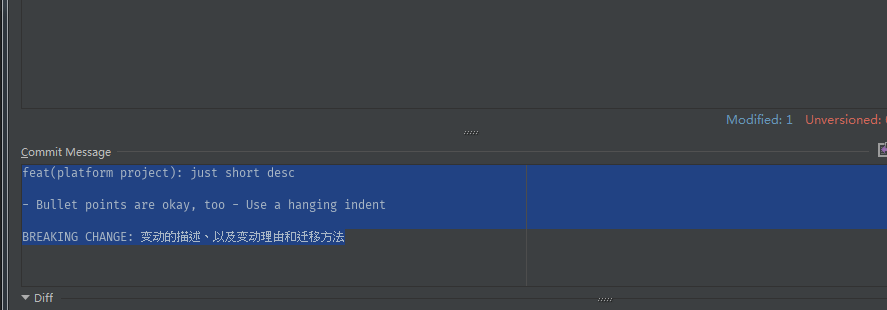

GIT提交日志规范
================================================

为了保证使用git的日志提交一致，现规定格式规范如下：

		<type>[<scope>]: <subject> //本行内容git在push到中央仓库时会被校验
		//空行
		<body>
		//空行
		<footer>

注意：type后若使用英文冒号，请多加一个空格。

#### 类型解释

**type**            
用于说明 commit 的类别，只允许使用下面7个标识，必传。   

        feat：新功能（feature）
        fix：修补bug
        docs：文档（documentation）
        style： 格式（不影响代码运行的变动）
        refactor：重构（即不是新增功能，也不是修改bug的代码变动）
        test：增加测试
        chore：构建过程或辅助工具的变动

**scope**           
用于说明 commit 影响的范围，比如数据层、编译期等等，视项目不同而变化，可选的。

**subject**                 
commit 提交目的的简短描述，不少于10个字符,，必传。

**body**            
是对本次 commit 的详细描述，可以分成多行，可选的，一般不传。

**footer**              
此处一般有两种情况，可选的，一般不传：              
1：与上一版本不兼容的变动，应说明变动的描述、以及变动理由和迁移方法。               
2：如果当前 commit 针对某个issue(gitlab上所提出的，我们一般用不到，因为我们的bug都提交在了禅道上)，那么可以在 Footer 部分关闭这个 issue。               

#### IDEA插件安装使用

* 安装文件夹中的插件（选择从硬盘安装），随后重启idea            

* 提交代码在安装成功后，commit页面会多出如下红圈标注的可点击图标，请不要再图标左下侧的文本区域进行注释编写，务必点击此按钮。            

* 在点击按钮后，会出现如下弹窗：                
 

               

* 左边的每个选型分别对应上述规则。在选择填写完成后，会自动生成符合格式的提交文本，如下：                

               
       

